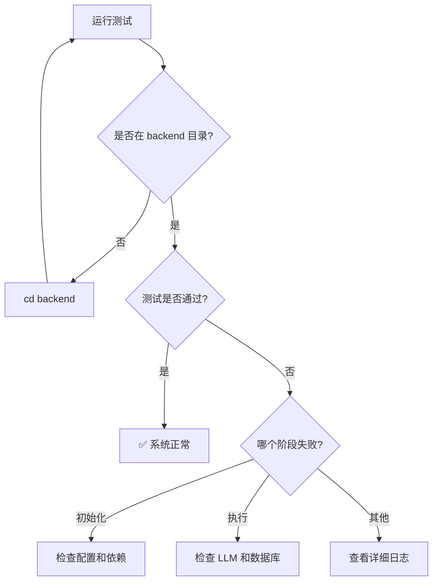

# MasterAgent V2 测试指南

## 📝 测试文件说明

本项目提供了两个测试文件用于验证 MasterAgent V2 的功能：

### 1. 快速测试 (test_master_agent_v2_quick.py)
**用途**: 快速验证基本功能是否正常

**测试内容**:
- ✅ 系统初始化
- ✅ MasterAgent V2 加载
- ✅ 简单对话测试
- ✅ 查询任务测试
- ✅ 流式执行测试

**运行时间**: 约 1-2 分钟

### 2. 完整集成测试 (test_master_agent_v2_integration.py)
**用途**: 全面测试所有功能

**测试内容**:
- ✅ Test 1: 简单对话（DirectAnswer 模式）
- ✅ Test 2: 简单查询
- ✅ Test 3: 复杂任务（StaticPlan 模式）
- ✅ Test 4: 流式执行
- ✅ Test 5: 增强上下文功能
- ✅ Test 6: V1 vs V2 对比
- ✅ Test 7: 错误恢复能力

**运行时间**: 约 3-5 分钟

---

## 🚀 运行测试

### 前置条件

1. **确保在正确的目录**:
   ```bash
   cd E:\Python\RAGSystem\backend
   ```

2. **确保环境已配置**:
   - Python 3.8+
   - 已安装依赖: `pip install -r requirements.txt`
   - Neo4j 服务正在运行
   - LLMAdapter 已正确配置

3. **激活虚拟环境** (如果使用):
   ```bash
   conda activate ragsystem
   ```

### 运行快速测试

```bash
python test_master_agent_v2_quick.py
```

**预期输出**:
```
=== 快速同步测试 ===

1️⃣ 初始化系统...
2️⃣ 加载 MasterAgent V2...
✓ 成功加载 5 个智能体
✓ MasterAgent V2 已就绪

3️⃣ 测试简单对话...
✓ 执行状态: 成功
✓ 执行时间: 1.23 秒
✓ 回答: 你好！我是一个智能助手...
✓ 执行模式: direct_answer

4️⃣ 测试查询任务...
✓ 执行状态: 成功
✓ 执行时间: 2.34 秒

✅ 快速同步测试通过！

=== 快速流式测试 ===
...
✅ 快速流式测试通过！

测试结果
同步测试: ✅ 通过
流式测试: ✅ 通过

🎉 所有快速测试通过！
```

### 运行完整集成测试

```bash
python test_master_agent_v2_integration.py
```

**预期输出**:
```
=== 初始化测试环境 ===
✓ LLM 适配器已加载
✓ 加载了 5 个智能体（V1）
✓ 加载了 5 个智能体（V2）
✓ 编排器注册了 4 个智能体

======================================================================
测试 1: 简单对话（DirectAnswer 模式）
======================================================================
✅ 测试 1 通过

...

测试结果汇总
test_1: ✅ 通过
test_2: ✅ 通过
test_3: ✅ 通过
test_4: ✅ 通过
test_5: ✅ 通过
test_6: ✅ 通过
test_7: ✅ 通过

总计: 7 个测试
通过: 7 个
失败: 0 个
成功率: 100.0%

🎉 所有测试通过！
```

---

## 🔧 常见问题排查

### 问题 1: ImportError

**错误信息**:
```
ImportError: cannot import name 'get_default_adapter'
```

**解决方法**:
```bash
# 确保在 backend 目录运行
cd E:\Python\RAGSystem\backend

# 检查是否有 llm_adapter 模块
ls llm_adapter/
```

### 问题 2: Neo4j 连接失败

**错误信息**:
```
ServiceUnavailable: Cannot connect to Neo4j
```

**解决方法**:
1. 启动 Neo4j Desktop
2. 确保数据库正在运行
3. 检查配置文件中的连接信息

### 问题 3: LLM API 错误

**错误信息**:
```
AuthenticationError: Invalid API key
```

**解决方法**:
1. 检查 API Key 配置
2. 访问 `/llm-adapter` 管理界面测试连接
3. 确认 API Key 有效且有余额

### 问题 4: 找不到 master_agent_v2

**错误信息**:
```
❌ 未找到 master_agent_v2
```

**解决方法**:
检查是否传递了 `use_v2=True`:
```python
agents = load_agents_from_config(
    ...,
    use_v2=True  # 必须设置
)
```

### 问题 5: register_agent() 参数错误

**错误信息**:
```
TypeError: register_agent() takes 2 positional arguments but 3 were given
```

**解决方法**:
已在最新版本修复。确保使用正确的调用方式:
```python
# ✅ 正确
orchestrator.register_agent(agent)

# ❌ 错误
orchestrator.register_agent(agent_name, agent)
```

---

## 📊 测试结果解读

### 测试通过 ✅

如果所有测试通过，说明：
- MasterAgent V2 已正确安装和配置
- 三种执行模式都能正常工作
- 流式执行功能正常
- 增强上下文管理正常
- 系统可以投入使用

### 部分测试失败 ⚠️

如果部分测试失败：
1. 查看详细的错误日志
2. 确认哪个测试失败
3. 根据错误信息排查问题
4. 如果是 LLM 相关错误，检查 API 配置
5. 如果是数据库相关错误，检查 Neo4j 连接

### 全部测试失败 ❌

如果全部测试失败：
1. 检查是否在正确的目录
2. 检查环境配置
3. 查看第一个失败的测试
4. 通常是系统初始化问题

---

## 🎯 快速诊断流程



---

## 💡 使用建议

### 开发阶段
1. **首次开发**: 运行快速测试验证基本功能
2. **功能开发**: 每次修改后运行相关测试
3. **提交前**: 运行完整集成测试

### 生产部署
1. **部署前**: 在测试环境运行完整测试
2. **部署后**: 运行快速测试验证
3. **定期**: 每周运行完整测试检查系统健康

### 调试问题
1. 先运行快速测试定位范围
2. 查看详细日志找到错误
3. 修改后重新运行测试验证

---

## 📚 相关文档

- **使用指南**: `MASTER_AGENT_V2_GUIDE.md` - 详细的使用说明
- **架构文档**: `MASTER_AGENT_V2_README.md` - 系统架构说明
- **API 文档**: 查看各模块的 docstring

---

## 🆘 获取帮助

如果遇到问题：
1. 查看错误日志的完整堆栈跟踪
2. 检查相关文档
3. 确认环境配置正确
4. 查看 Neo4j 和 LLM 服务状态

---

**最后更新**: 2025-01-07
**版本**: 1.0
