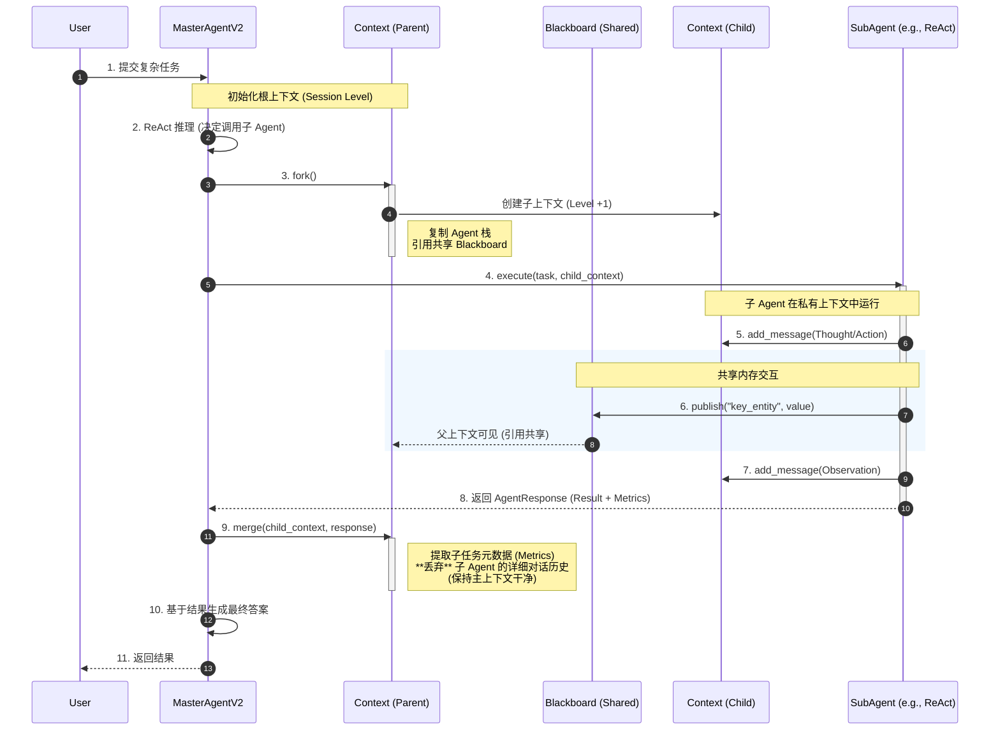

# 全局上下文分层架构时序图

本文档展示了重构后的 **全局上下文分层架构 (Hierarchical Context Architecture)** 的工作流程。

该架构通过 `Fork`（派生）和 `Merge`（合并）机制，实现了 Master Agent 与 Sub Agent 之间的上下文隔离与通信，同时通过 **Blackboard (黑板)** 机制实现了跨层级的数据共享。

## 1. 核心交互流程 (Mermaid)

## 2. 关键机制说明

### A. 上下文隔离 (Context Isolation)
*   **Fork**: 当 `Master` 调用 `SubAgent` 时，通过 `context.fork()` 创建一个新的 `Child Context`。
*   **执行**: `SubAgent` 所有的思考过程（Thought）、工具调用（Action）和详细结果（Observation）都只记录在 `Child Context` 中。
*   **效果**: 防止子任务的繁琐细节（如多次重试、中间报错）污染 `Master` 的上下文窗口，节省 Token 并保持主逻辑清晰。

### B. 黑板通信 (Blackboard Communication)
*   **共享**: `Child Context` 不复制 `shared_data`，而是持有父级 `Blackboard` 的引用。
*   **实时性**: 子 Agent 一旦调用 `context.publish()`，父 Agent（以及同一 Session 下的其他 Agent）可以立即通过 `context.get_blackboard()` 获取数据。
*   **场景**: 用于传递高价值实体（如：提取到的订单号、用户偏好、关键结论）。

### C. 结果合并 (Merge Protocol)
*   **Merge**: 任务结束时，`Master` 调用 `context.merge()`。
*   **策略**: 默认**不合并**子 Agent 的消息历史。仅合并：
    1.  `AgentResponse` 中的最终结果文本。
    2.  `Metrics`（执行质量、有用性评分）。
    3.  `Metadata`（执行耗时、工具调用统计）。
