# MasterAgent V2 架构可视化图表

本文档包含 MasterAgent V2 多智能体系统的各类架构图，使用 Mermaid 格式绘制。

---

## 1. 系统总体架构图

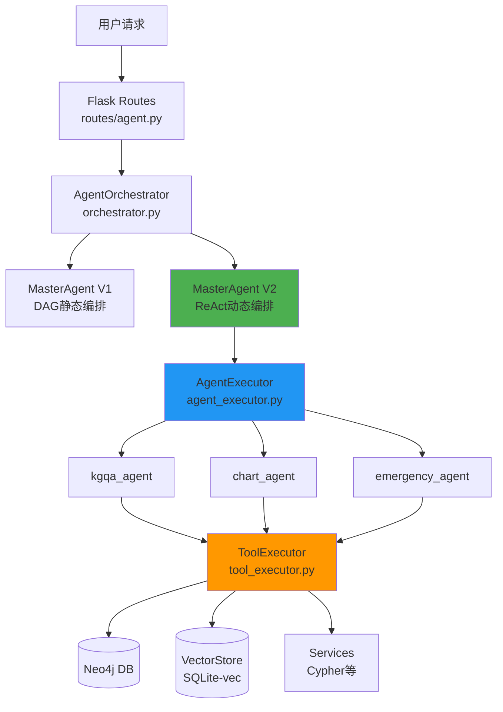

---

## 2. MasterAgent V2 执行流程图

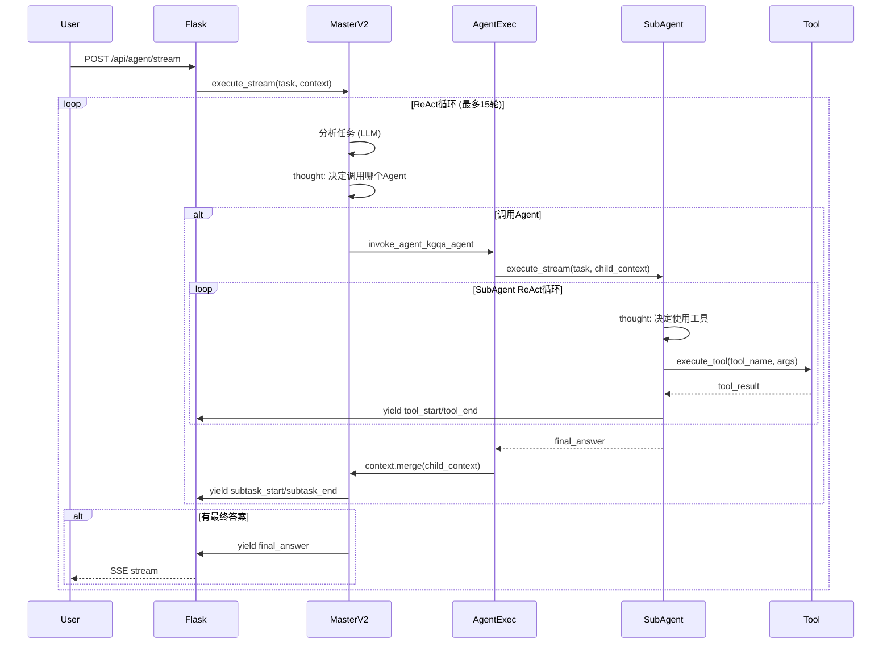

---

## 3. 上下文分层与Fork/Merge机制

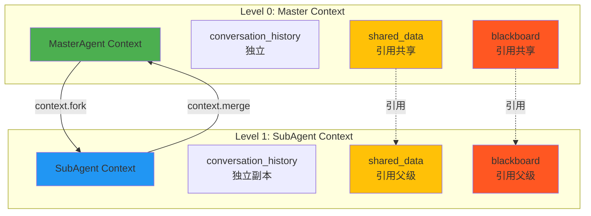

---

## 4. 数据流与事件流

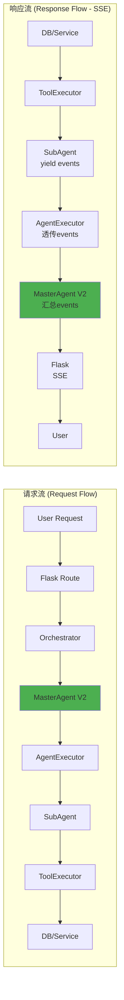

---

## 5. 循环依赖问题可视化

### 5.1 当前的循环依赖

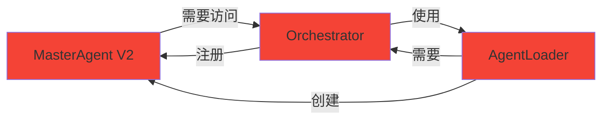

### 5.2 解耦后的依赖关系 (事件总线方案)

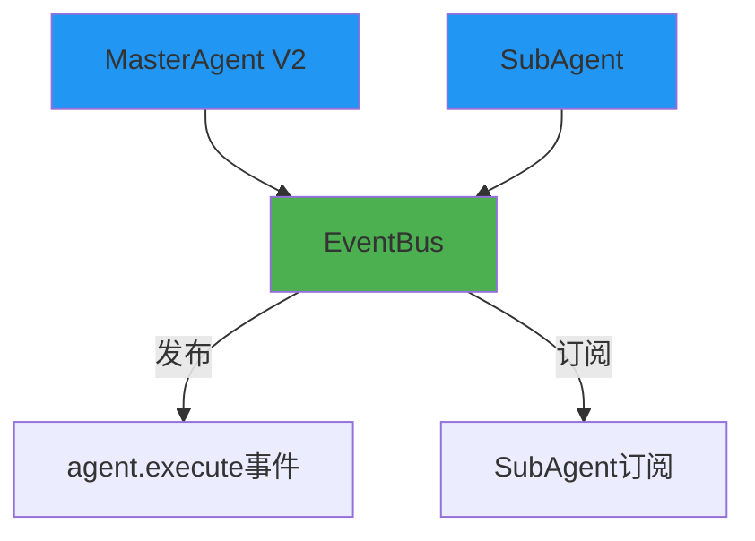

---

## 6. Agent工具调用拓扑 (MasterV2特有)

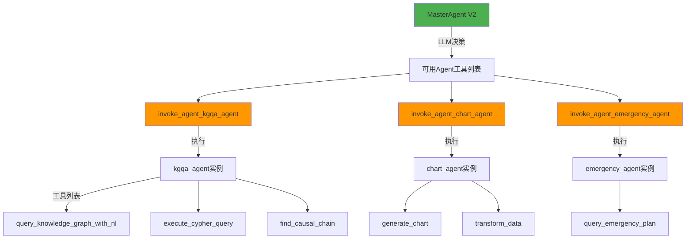

---

## 7. 性能瓶颈点标注

```mermaid
graph TB
    User[用户请求] --> Flask[Flask Routes]
    Flask --> Orch[Orchestrator<br/>⚠️ 单例瓶颈]

    Orch -->|共享| LLM[LLMAdapter<br/>⚠️ 全局单例]

    Orch --> MasterV2[MasterAgent V2]
    MasterV2 -->|使用| LLM

    MasterV2 --> AgentExec[AgentExecutor]
    AgentExec --> SubAgent[SubAgent]
    SubAgent -->|使用| LLM

    SubAgent --> ToolExec[ToolExecutor<br/>⚠️ Switch-Case O(n)]

    ToolExec --> Neo4j[(Neo4j)]
    ToolExec --> Vector[(VectorStore)]

    style Orch fill:#F44336
    style LLM fill:#F44336
    style ToolExec fill:#FF9800
```

---

## 8. 改进后的架构 (事件驱动 + 池化)

```mermaid
graph TB
    User[用户请求] --> Flask[Flask Routes]
    Flask --> ReqOrch[请求级Orchestrator<br/>✅ 隔离状态]

    ReqOrch --> Pool[LLMAdapter Pool<br/>✅ 连接池]

    ReqOrch --> MasterV2[MasterAgent V2]
    MasterV2 -->|publish| EventBus[EventBus<br/>✅ 解耦通信]

    EventBus -->|subscribe| SubAgent1[SubAgent 1]
    EventBus -->|subscribe| SubAgent2[SubAgent 2]

    SubAgent1 --> Registry[ToolRegistry<br/>✅ O(1)查找]
    SubAgent2 --> Registry

    Registry --> Tool1[Tool 1]
    Registry --> Tool2[Tool 2]
    Registry --> Tool3[Tool 3]

    style ReqOrch fill:#4CAF50
    style Pool fill:#4CAF50
    style EventBus fill:#4CAF50
    style Registry fill:#4CAF50
```

---

## 9. 工具注册表优化前后对比

### 9.1 优化前 (Switch-Case)

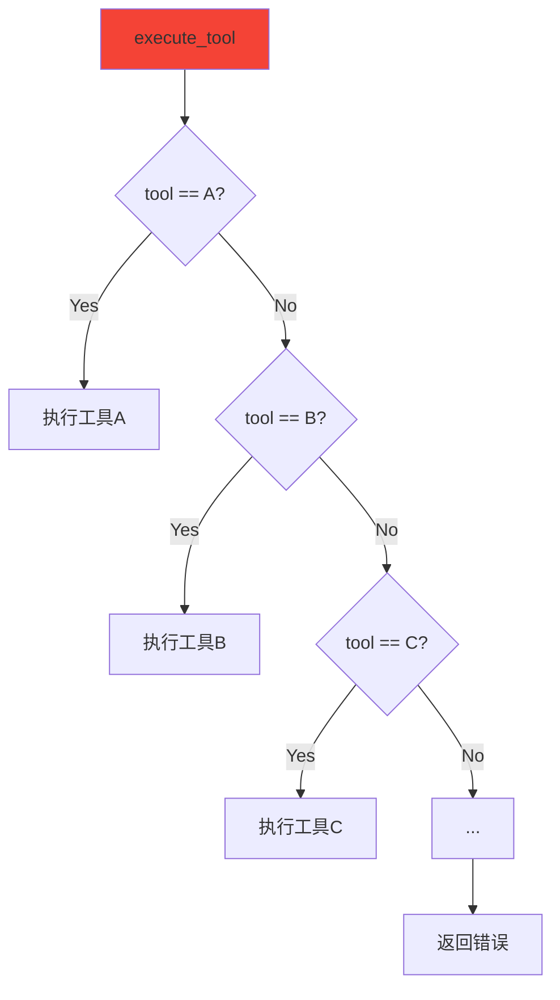

**时间复杂度**: O(n) - 最坏情况需要遍历所有工具

### 9.2 优化后 (注册表)

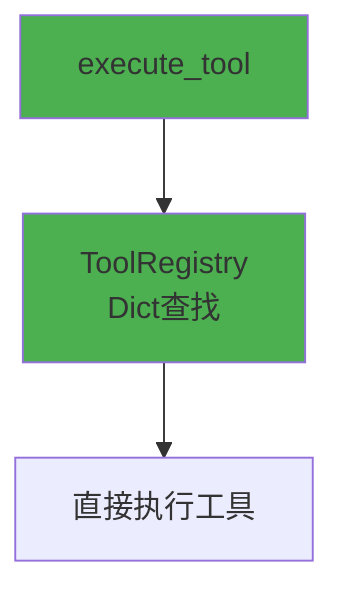

**时间复杂度**: O(1) - 直接哈希查找

---

## 10. 分布式追踪链路图

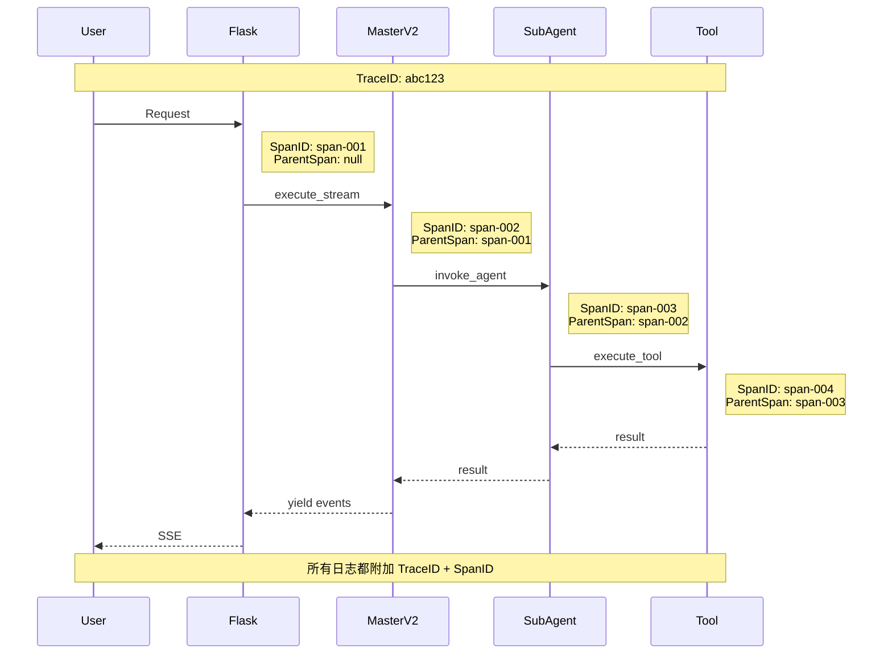

---

## 11. 插件化架构愿景

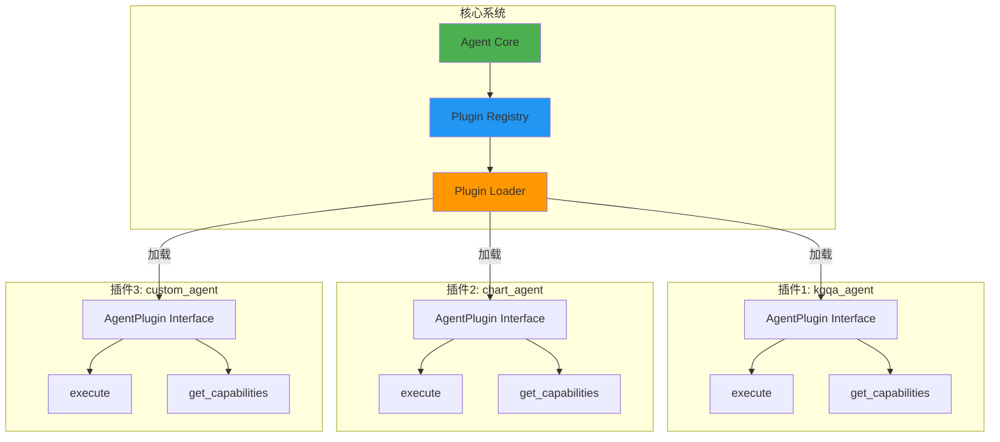

---

## 12. 异步化架构愿景

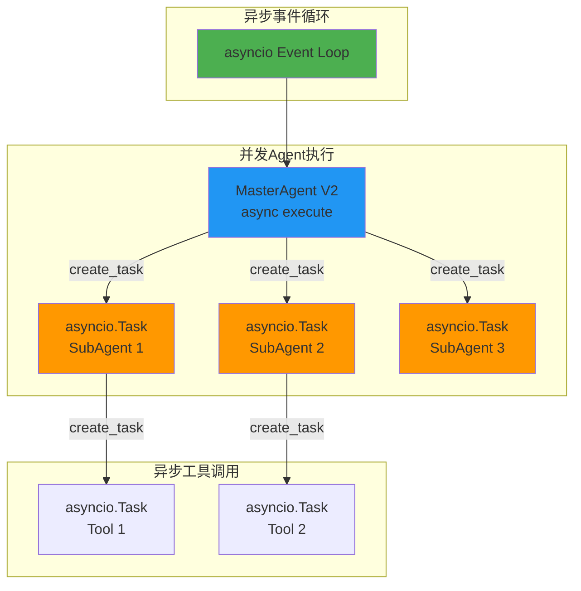

---

## 13. 微服务化部署拓扑

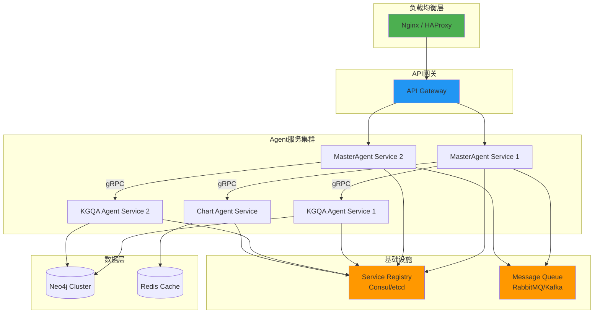

---

## 使用说明

### 在 Markdown 编辑器中查看

支持 Mermaid 的 Markdown 编辑器：
- **Typora** (推荐)
- **VS Code** (需安装 Mermaid 插件)
- **GitHub** (原生支持)
- **GitLab** (原生支持)

### 导出为图片

使用 Mermaid CLI:
```bash
npm install -g @mermaid-js/mermaid-cli

# 导出单个图表
mmdc -i architecture.mmd -o architecture.png

# 导出所有图表
mmdc -i MASTER_AGENT_V2_ARCHITECTURE_DIAGRAMS.md -o diagrams/
```

### 在线编辑

- [Mermaid Live Editor](https://mermaid.live/)
- 复制图表代码到编辑器进行修改和导出

---

**文档版本**: 1.0
**创建日期**: 2026-02-11
**维护者**: RAGSystem Team
